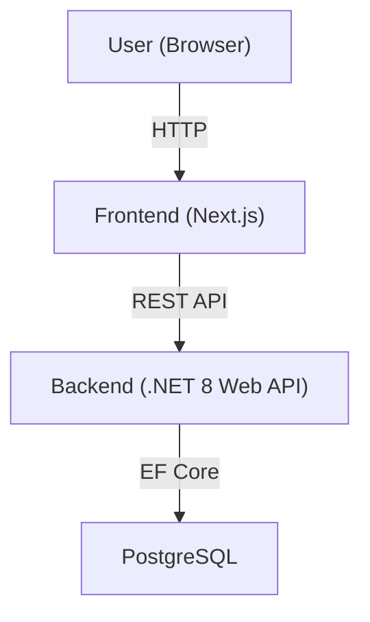

# FizzBuzz Game Platform

A full-stack, containerized web application for managing and playing customizable FizzBuzz games. This project features a robust .NET 8 backend, a modern Next.js (React) frontend, and a PostgreSQL database, all orchestrated with Docker Compose for seamless local development and deployment.

---

## Table of Contents
- [Project Overview](#project-overview)
- [Architecture](#architecture)
- [Technology Stack](#technology-stack)
- [Getting Started](#getting-started)
  - [Prerequisites](#prerequisites)
  - [Local Development](#local-development)
  - [Dockerized Setup](#dockerized-setup)
- [Project Structure](#project-structure)
- [Environment Variables](#environment-variables)
- [Usage](#usage)
- [Testing](#testing)
- [Troubleshooting](#troubleshooting)
- [Contributing](#contributing)
- [License](#license)

---

## Project Overview

This platform allows users to create, manage, and play FizzBuzz games with custom rules and templates. It provides:
- A RESTful API for game management and statistics
- A user-friendly web interface for gameplay and administration
- Persistent storage of game sessions and history

---

## Architecture



- **Frontend:** Next.js (React, TypeScript, Tailwind CSS)
- **Backend:** ASP.NET Core 8 Web API (C#)
- **Database:** PostgreSQL
- **Containerization:** Docker & Docker Compose

---

## Technology Stack

- **Frontend:** Next.js 15, React 19, TypeScript, Tailwind CSS
- **Backend:** ASP.NET Core 8, Entity Framework Core, C#, Swagger
- **Database:** PostgreSQL (official Docker image)
- **Testing:** Jest, React Testing Library, xUnit (C#)
- **DevOps:** Docker, Docker Compose

---

## Getting Started

### Prerequisites
- [Docker](https://www.docker.com/get-started)
- [Docker Compose](https://docs.docker.com/compose/)
- (Optional for local dev) [.NET 8 SDK](https://dotnet.microsoft.com/en-us/download/dotnet/8.0)
- (Optional for local dev) [Node.js 18+](https://nodejs.org/)

### Local Development

#### Backend
1. Navigate to `BackEnd/WebApplication1/WebApplication1`.
2. Configure your database connection in `appsettings.Development.json`.
3. Run migrations and start the API:
   ```bash
   dotnet ef database update
   dotnet run
   ```
   The API will be available at `http://localhost:8080`.

#### Frontend
1. Navigate to `FrontEnd/my-app`.
2. Install dependencies:
   ```bash
   npm install
   ```
3. Start the development server:
   ```bash
   npm run dev
   ```
   The app will be available at `http://localhost:3000`.

### Dockerized Setup (Recommended)

1. From the project root, run:
   ```bash
   docker-compose up --build
   ```
2. Access the services:
   - Frontend: [http://localhost:3000](http://localhost:3000)
   - Backend API: [http://localhost:8080](http://localhost:8080)
   - PostgreSQL: `localhost:5444` (default user: `postgres`, password: `postgres`)

---

## Project Structure

```
FinalExam/
├── BackEnd/
│   └── WebApplication1/
│       ├── WebApplication1/         # ASP.NET Core Web API
│       └── WebApplication1.Tests/   # Backend unit tests
├── FrontEnd/
│   └── my-app/                      # Next.js frontend
├── docker-compose.yml               # Multi-service orchestration
```

---

## Environment Variables

### Backend
- `ASPNETCORE_ENVIRONMENT` (default: Development)
- `ConnectionStrings__DefaultConnection` (see `docker-compose.yml`)

### Frontend
- `NEXT_PUBLIC_API_URL` (should point to backend API, e.g., `http://backend:8080` in Docker)
- `PORT` (default: 3000)

### Database
- `POSTGRES_USER`, `POSTGRES_PASSWORD`, `POSTGRES_DB` (see `docker-compose.yml`)

---

## Usage

- **Create Game Templates:** Define custom FizzBuzz rules and templates via the web UI.
- **Start Game Sessions:** Play games based on templates, submit answers, and view results.
- **View History & Stats:** Track past games and player statistics.
- **API Documentation:** Swagger UI available at `/swagger` when running backend in development mode.

---

## Testing

### Backend
- Navigate to `BackEnd/WebApplication1/WebApplication1.Tests` and run:
  ```bash
  dotnet test
  ```

### Frontend
- Navigate to `FrontEnd/my-app` and run:
  ```bash
  npm test
  ```

---

## Troubleshooting
- Ensure Docker Desktop is running and ports 3000, 8080, and 5444 are free.
- If the backend cannot connect to the database, check the `ConnectionStrings` and ensure the `db` service is healthy.
- For CORS issues, ensure the frontend uses the correct API URL.
- For database persistence, data is stored in the `db-data` Docker volume.

---

## Contributing

Contributions are welcome! Please fork the repository and submit a pull request. For major changes, open an issue first to discuss your ideas.

---

## License

This project is licensed under the MIT License. 